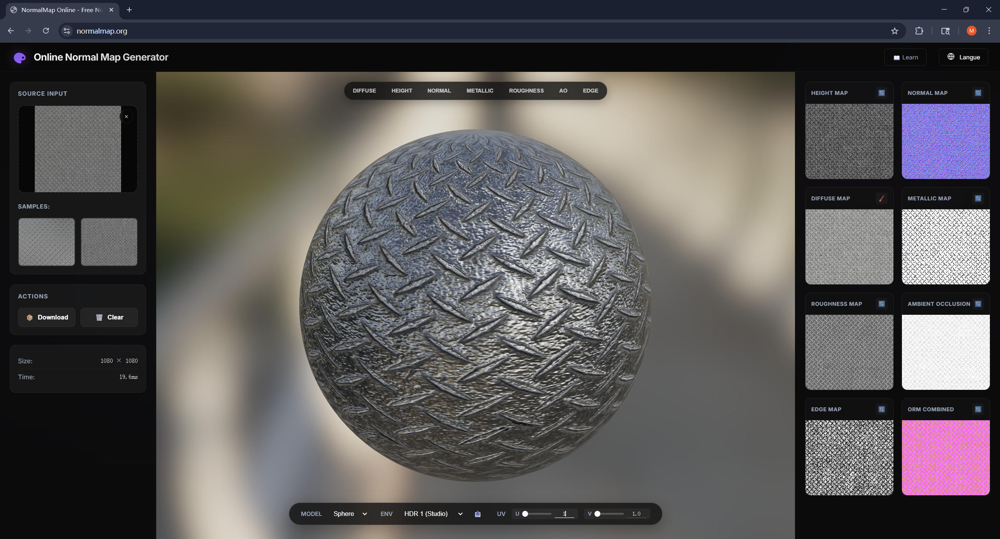
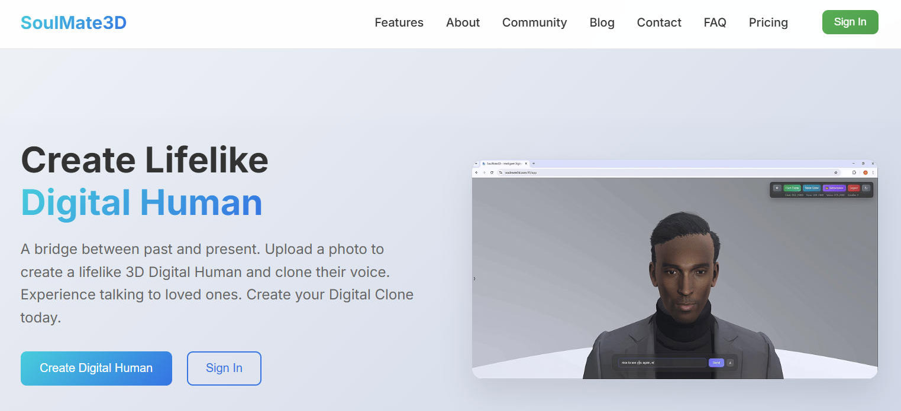

# Online Normal Map Generator

[简体中文 (Simplified Chinese)](README_zh-CN.md)

An open-source, browser-based online tool for generating high-quality PBR texture maps from a single Diffuse map.

🔗 **[Online Demo](https://normalmap.org/)**



## ✨ Features

*   **Generate Multiple Maps**:
    *   🔵 **Normal**: High-quality normal map generation.
    *   ⛰️ **Height (Displacement)**: Used for displacement or parallax mapping.
    *   ✨ **Roughness**: Calculated based on image brightness and contrast.
    *   🪙 **Metallic**: Simple threshold and mask control.
    *   🌑 **Ambient Occlusion (AO)**: Calculates and adds shadow details in crevices.
*   **Real-time 3D Preview**: Built-in Three.js-based preview window supporting custom HDR environments and various models (Sphere, Cube, Cylinder, etc.).
*   **Privacy & Security**: All image processing logic is executed locally in your browser via WebGL. **Images are NEVER uploaded to any server.**
*   **Batch Export**: Download all generated maps in a single ZIP file.
*   **Multi-language Support**: Native support for English and Simplified Chinese.

## 🚀 How to Run

This is a pure static web application. You can run it using any of the following methods:

### 1. Windows Quick Start (Recommended)
Double-click the `start.bat` file in the root directory. It will automatically detect Python or Node.js in your system and start a local web server.

### 2. Python
```bash
python -m http.server 8000
```
Then visit `http://localhost:8000`

### 3. Node.js
```bash
npx http-server -p 8000
```

### 4. VS Code
Use the "Live Server" extension: Right-click `index.html` -> "Open with Live Server".

## 🛠️ Tech Stack

*   **Core Logic**: Vanilla JavaScript (ES6+)
*   **Graphics Processing**: WebGL / GLSL Shaders
*   **3D Rendering**: Three.js
*   **Styling**: CSS3 (Variables)

## 🔗 More Tools

Check out my other independent applications:

*   **[CrazyTools.online](https://crazytools.online)** - Independently developed professional Web graphics and creation tools.
*   **[Soulmate 3D](https://soulmate3d.com)** - Create a realistic 3D Digital Human from a single photo. Clone any voice from just 10 seconds of audio to experience talking to loved ones.
    
    

